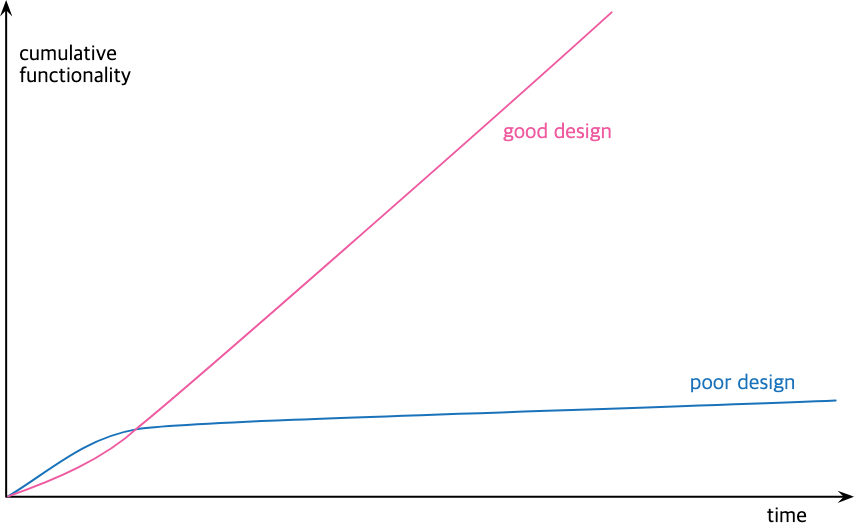

> 2. Principles In Refactoring

# Defining Refactoring

- Refactoring(N.): 외부 동작을 유지하면서도 쉽게 이해하고 손쉽게 수정하기 위한 소프트웨어 내부 구조의 변화
- Refactoring(V.): 외부 동작을 유지하면서 일련의 refactoring들을 적용하여 소프트웨얼를 재구성 하다

- Refactoring 은 작은 단위의 behavior-preserving steps 를 적용하는 것이다. 일련의 단계들이 쌓여 큰 변화를 만들어낸다.
- 리팩토링을 수행할 때 broken state 상태로 많은 시간을 보내지 않아야 언제든지 그 변화 단계를 중단할 수 있다.

> If someone says their code was broken for a couple of days while they are refactoring, you can be pretty sure they were not refactoring.

- Observable behavior(외부 동작): 코드는 refactoring 전 과 후에 동일한 동작을 수행해야함
  - Interface 를 수정했더라도 기존에 있던 버그는 그대로 유지되어야 한다
- Refactoring 은 성능 최적화와 유사하다. 코드를 수정한다고 해서 전체 프로그램의 기능이 바뀌는 것은 아니다.

# The Two Hats

- 개발자는 아래 두 가지 모드에 대한 전환이 빨라야 한다
  - Adding functionality: 기존 코드를 수정해서는 안된다. 새로운 테스트와 기능만 추가한다.
  - Refactoring: 기능 추가를 하지 않는다. 코드만 재구성한다. interface 가 바뀌는 경우에만 test 를 수정한다.

# Why Should We Refactor?

- Refactoring 이 만능은 아니지만 유용한 툴이다.

## Refactoring Improves the Design of Software

- Refactoring 없이는 내부 구조는 썩어간다.
- 구조 전체에 대한 이해 없이 단기 목표를 위해 코드 수정을 하다보면 코드는 구조를 잃는다.
- 구조를 잃어갈수록 보존하기도 어려워져서 급속도로 코드의 품질이 낮아진다.
- 정기적인 refactoring 을 통해 코드의 구조를 유지 해야한다.
- 잘못된 설계의 코드는 더 많은 코드양을 가진다 => 중복 코드를 제거하는 것이 구조 개선을 위한 핵심이다.
- 코드의 양을 줄이는 것이 시스템의 속도를 빠르게 하는것은 아니지만, 개발자의 이해를 증가시키고, 수정할 코드의 양을 줄여준다.

## Refactoring Makes Software Easier to Understand

- Programming 은 컴퓨터와 대화하는 것이지만 더 중요한 것은 내 코드를 읽을 사람이다.
- 심지어 그 사람은 미래의 내가 될 수 있다.
- 필요한 정보들을 잘 구조화해서 정리해두면 굳이 암기하지 않아도 코드만 보고 이해할 수 있다.

## Refactoring Helps Me Find Bugs

- 프로그램의 구조를 명확히 하는 과정에서 버그를 찾을 수 있다.

## Refactoring Helps Me Program Faster

- 프로그램이 커질 수록 코드를 이해하는데 걸리는 시간이 늘어나서 개발 속도가 느려진다.
- Refactoring 을 통해 코드를 이해하기 쉽게 만들면 개발 속도가 빨라진다.
  

# When Should We Refactor?

## The Rule of Three

- just do
- duplicate
- refactor

## Preparatory Refactoring—Making It Easier to Add a Feature

- 비슷한 동작을 하는 함수 복제
- 필요한 부분만 수정
- 추후 양쪽을 수정 해야하는 상황이 생기는 경우, `Parameterize Function` 수행

- 문제 발견
- 여러 중복 코드를 하나로 모으거나
- 때로는 update logic 을 query 로부터 분리 하여 상황을 개선하면 더 쉽게 수정할 수 있다.

## Comprehension Refactoring: Making Code Easier to Understand

- 코드를 이해할때는 해당 코드를 즉시 개선할 수 있는지 확인해본다
  - 서투른 구조의 조건절이나 나쁜 이름의 함수를 살펴볼수 있다
- 머리로는 이해가 조금 되었겠지만 리팩토링을 하면서 이해한 내용을 코드로 표현하면 더 명확해지고 동료들에게도 공유할 수 있다.
- 미래의 나 뿐만 아니라 현재의 나도 도움을 받는다.
- 리팩토링을 하면서 코드를 바꿔보지 않으면 깊은 이해를 할 기회를 놓치게 된다.

## Litter-Pickup Refactoring

- 코드를 수정하기 쉬운 경우 바로 수정
- 시간이 걸릴 것으로 보이는 경우 note 작성하고 현재 작업을 마무리 한 후 수정
- 오래된 캠핑 격언에서는 항상 캠핑장을 떠날때는 왔을때보다 깨끗하게 해야한다고 한다.
- 코드도 마찬가지로 코드를 살펴볼때마다 조금씩 개선한다면 시간이 지남에 따라 문제를 개선할 수 있다.

## Planned and Opportunistic Refactoring

- 리팩토링은 프로그래밍과 분리된 활동이 아니다
- 대부분의 리팩토링은 프로그래밍 작업을 수행하면서 함께 이루어진다

- > You have to refactor when you run into ugly code—but excellent code needs plenty of refactoring too.

  - 과거에는 옳았던 개발 방식이 현재는 다를 수 있다. 좋은 코드도 개선이 필요하다

- > for each desired change, make the change easy (warning: this may be hard), then make the easy change
  - Sofware 는 단순 누적의 개념이 아니다
  - 좋은 개발자는 기능을 추가하는 가장 빠른방법은 기존 코드를 추가가 쉬운 형태로 변경하는 것이라는 것을 안다
    - 변화는 새로 추가될 기능보다 기존 코드에서 일어날 때 더 효과적이다
- 리팩토링은 날잡고 하는게 아니라 평범하고 기회주의적 이어야 한다
- 기능 추가와 리팩토링 commit 은 분리하는 것이 좋다

## Long-Term Refactoring

- 리팩토링이 장기적으로 수행되야 하더라도 전담으로 리팩토링 시간을 잡는건 좋지 않다
- 몇 주에 걸쳐서라도 리팩토링 영역에 있는 코드에 접근할 떄마다 점진적으로 개선하는게 좋다

### Branch By Abstraction

- 라이브러리를 변경하는 경우 두 라이브러리에 대한 인터페이스 역할을 할 새로운 추상화를 도입

## Refactoring in a Code Review

- 리팩토링을 하기 위해서는 코드를 먼저 이해해야하고, 리팩토링 결과를 리뷰의 결과물로 보여줄 수 있기 때문에 효과적이다.
- 리뷰어가 단독으로 코드리뷰를 하면서 리팩토링을 하는 것보다는 페어프로그래밍을 하는 것이 저자의 의도를 이해하기 수월하다

## What Do I Tell My Manager?

- 말하지 마라. 매니저는 최대한 빨리 개발하기를 원할 것이고 가장 빨리 개발하는 법은 리팩토링을 먼저 하는 것이므로 작업의 일부일 뿐이다.

## When Should I Not Refactor?

- 수정할 필요 없이 단순 사용만 하는 API 의 경우 리팩토링 할 필요 없다. 이해가 필요한 경우에만 리팩토링 수행
- 전체를 다시 작성하는게 더 쉬울 경우 리팩토링 필요 없다

# Problems with refactoring

- 모든 기술은 장단점이 있기 때문에 어떤 영향을 미칠지 파악하는 것이 중요하다

## Slowing Down New Features

> The whole purpose of refactoring is to make us program faster, producing more value with less effort.

- 추가할 기능이 너무 작은 경우 리팩토링을 하지 않고 그대로 두는 경우도 있다
- 업계에서는 리팩토링을 너무 많이 하는 것보다는 너무 안하는 경향이 더 강하다
- 리팩토링을 클린코드나 도덕적인 측면에서 바라보면 안된다. 경제적으로 이득이 되므로 반드시 해야하는 것으로 생각하라

## Code Ownership

- published interface: `Change Function Declaration` 을 하고 싶지만 다른 팀과 함께 사용하고 있거나 소유권 자체가 타팀에 있는 경우
  - `Rename fuction` 수행 하고 기존 정의가 새로운 이름을 바라보게 하면 client 를 수정하지 않아도 된다
- 하지만 이 경우에는 복잡도를 올리기 때문에 세분화된 코드 소유권을 가지는 것이 좋다
  - 적어도 팀 안에서는 타인이 작성한 코드여도 자유롭게 수정할 수있는 권한을 주는것을 권장
- 오픈소스 관련 시스템의 경우 팀을 벗어나 자유롭게 수정하기도 한다

## Branches

- feature branch 의 개발 기간이 늘어날수록 main 과의 merge or integration 이 어려워진다
  - merge: 단방향으로 병합
  - integration: 양방향으로 병합
- Continuous Integration: feature branch 의 기간을 최소화 해야 병합도 쉽고 리팩토링도 쉬워진다
  - 리팩토링은 함수명 변경 등 semantic 변화가 많기 때문에 병합의 단위가 작을수록 좋다

## Testing

- 리팩토링 시마다 자주 수행할 수 있도록 테스트는 빠르고 가벼워야한다
- 가끔은 테스트 없이 리팩토링 툴의 자동 리팩토링에 의존하는 경우도 있다
- 작은 단위의 리팩토링, CI 의 연계를 위해 테스트는 필수적이다

## Legacy Code

- Legacy code 는 복잡하고 테스트가 결여되어있고 심지어 타인이 작성한 코드이다
- 리팩토링은 Legacy code 를 이해하기 위한 가장 좋은 방법이다
- 하지만 테스트가 없다면? 테스트를 추가하면 된다
- 하지만 최초에 테스트를 고려하지 않고 설계되었다면? 테스트를 추가할 이음새를 만들면 된다
- 그 이음새를 만드려면 결국 리팩토링이 필요한데, 이 시점에는 테스트가 없기때문에 위험하지만 충분히 가치있다.
- 결국은 개발 초기부터 테스트코드를 작성하는 것이 중요하다

## Databases

- DB 내 스키마를 변경하는 일은 data migration script 만 추가로 작성한다면 `Change Function Declaration` 과 유사하다

- 단, 복구를 위해 운영 릴리즈는 여러번에 걸쳐 수행하는 것이 좋다
  - `Parallel change`: 컬럼명을 변경하는 경우 복제본 컬럼을 만들고 충분한 버그 검증 시간을 가진 후에 배포한다

# Refactoring, Architecture, and Yagni

- 과거에는 설계와 아키텍처는 코드 작성 전에 완성되고 변할 일이 없다고 생각 되었다
- 하지만 점진적인 리팩토링은 설계와 아키텍처 역시 개선시킨다
- 코드 작성 전에 설계를 완성하려면 모든것을 이해해야하는데 그것은 불가능하다
- 미래의 변화에 대응하는 방법 중 하나는 유연한 설계를 하는 것이지만, 함수가 범용성을 가질것으로 보인다고 해서 파라미터의 개수를 늘리기만 하면 복잡도만 늘어나게 된다
- 유연한 설계는 변화에 대응하는 능력을 낮출 수 있다
- `Yagni``: 리팩토링을 활용한다면 현재 꼭 필요한 기능만 먼저 구현하고 추후에 리팩토링을 하면 된다.
- 나중에 리팩토링 하는것이 상당히 어려울 것 같은 경우에만 유연성 메커니즘을 미리 추가한다

# Refactoring and the Wider Software Development Process

- continuous integration, TDD(self-testing code + refactoring)
- Yagni 와 refactoring 의 상호 보완

# Refactoring and Performance

- 리팩토링이 속도를 느리게 할 수 있지만, 먼저 튜닝 가능한 상태로 리팩토링을 하고 성능을 향상 시키는 것이 순서이다
- 빠른 성능의 소프트웨어 작성에 대한 일반적인 접근 방식

1. 각 컴포넌트에 시간과 공간에 대한 예산 할당
2. 항상 최고의 성능을 유지하는 방법: 대부분 좁은 관점에서 이루어지고, 복잡도로 인해 개발속도는 저하됌
3. 90%의 통계를 활용 하는 법
   - 대부분의 성능저하는 10% 미만의 코드에서 발생
   - 모니터링을 통해 성능 핫스팟을 찾고 해당 부분에 대해서만 constant-attention 방식 수행
   - 작은 단계로 변경을 수행하고 다시 테스트 수행 및 모니터링
   - 성능이 개선되지 않으면 변경사항 철회
   - 만족할 성능을 얻을 때까지 반복

# Where Did Refactoring Come From?

- 리팩토링은 1990년대 중반에 Ward Chunningham 과 Kent Beck 에 의해 발전 되었다. 두 사람이 일한 Smalltalk 는 당시에도 리팩토링에 우호적인 환경이였고 그 환경에 적합한 Extreme Programming 이 발전되었다. 그 일부인 리팩토링은 지속적으로 발전
- GoF 디자인 패턴을 쓴 Ralph Johnson 은 리팩토링에 흥미가 있었고 그 제자인 Bill Opdyke 가 쓴 박사 논문이 실질적인 리팩토링의 시작이라고 할 수 있다
- John Brant 와 Don Roberts는 Refactoring Browser 라는 tool 을 만듬

# Automated Refactorings

- Java

  - Smalltalk Refactoring Browser
  - JetBrains IntelliJ IDEA
  - IBM VisualAge for Java
  - Eclipse

- C#

  - JetBrains's Resharper,
  - a plug-in for Visual Studio

- 리팩토링 자동화를 가장 쉽게하는 법은 Text 기반으로 search/replace 를 하거나 emacs 의 macro 를 사용하는 것이다
- 더 정교한 리팩토링을 위해서는 syntax tree 를 사용해야 한다

- 정적 타입을 가진 언어에서 자동 리팩토링은 더 정교하게 동작할 수 있다
- 일부 툴에서는 변수를 rename 하면 해당 이름을 참조하는 comment들을 수정할 수 있도록 프롬프트를 띄워준다
- `Extract Function`을 수행할 경우 동일한 body 를 가진 함수를 모두 찾아서 추출해주기도 한다
- `Method.invoke` 와 같은 reflective call 의 경우 자동 refactoring 이 어려우므로 결국은 테스트가 있는것이 좋다

# Going Further

- [Bill Wake's Refactoring Workbook](https://www.informit.com/store/refactoring-workbook-9780321109293)
- [Josh Kerievsky's Refactoring to Patterns](https://martinfowler.com/books/r2p.html)
- [Gang of Four](https://www.informit.com/store/design-patterns-elements-of-reusable-object-oriented-9780201633610?ranMID=24808)
- [Refactoring Databases](https://martinfowler.com/books/refactoringDatabases.html)
- [Refactoring HTML](https://martinfowler.com/books/refactoringHtml.html)
- [Working Effectively with Legacy Code](https://martinfowler.com/books/refactoring-bibliography.html#feathers-welc): how to think about refactoring an older codebase with poor test coverage.
- [Ruby programming language](https://martinfowler.com/books/refactoringRubyEd.html)
- [refactoring web site](https://refactoring.com/)
