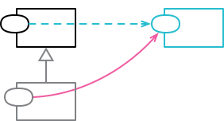

```js
class Order {
  get daysToShip() {
    return this._warehouse.daysToShip;
  }
}

class PriorityOrder extends Order {
  get daysToShip() {
    return this._priorityPlan.daysToShip;
  }
}
```

👇

```js
class Order {
  get daysToShip() {
    return this._priorityDelegate
      ? this._priorityDelegate.daysToShip
      : this._warehouse.daysToShip;
  }
}

class PriorityOrderDelegate {
  get daysToShip() {
    return this._priorityPlan.daysToShip;
  }
}
```
